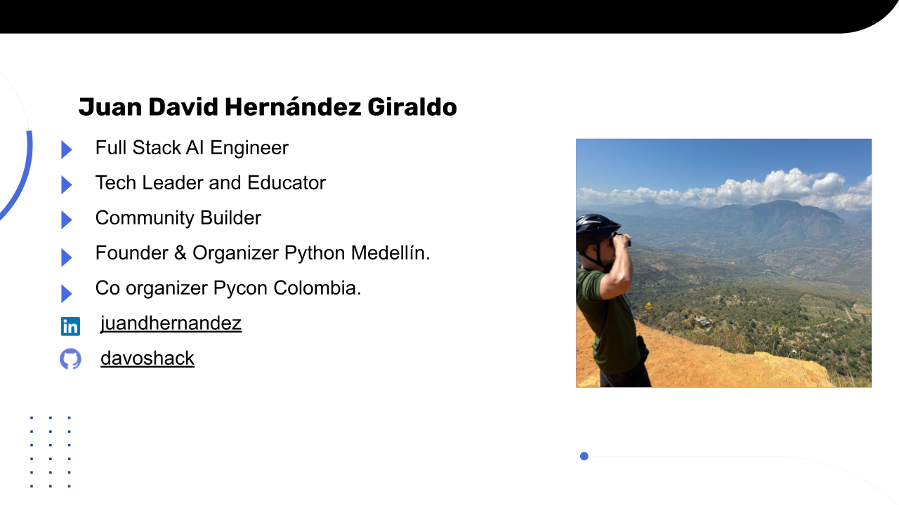

# AI Agents: Building AI Agents From Scratch

## About Me


## Prerequisites

If you are attending this workshop you will need a **laptop with a browser** and a **GitHub account**. The tutorial can be entirely completed using [GitHub Codespaces](https://github.com/features/codespaces), a free online development environment.

If you would prefer to run everything on your own machine you will need a **Python 3.9 or higher** local development environment with the ability to create a virtual environment and install packages using `pip` and `uv`.

You can pre-install the packages we will be using like this:

```bash
git clone git@github.com:davoshack/agents-workshop-tribu-ai.gi

uv venv --python=3.12.0
source .venv/bin/activate
uv sync
```

# Platforms

## Credentials and API Keys for

- https://e2b.dev/dashboard/jdhernandez/keys
- https://ollama.com/settings
- https://huggingface.co/settings/profile
- https://arize.com/
- app.tavily.com/home
- https://groq.com/
- https://platform.openai.com/


